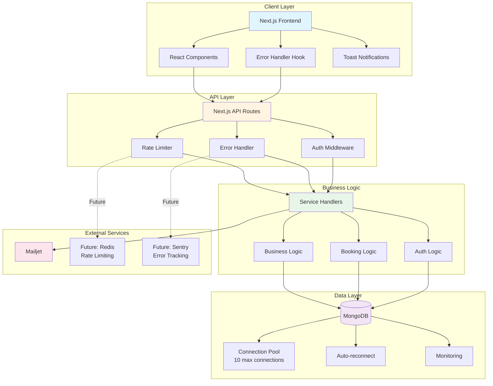
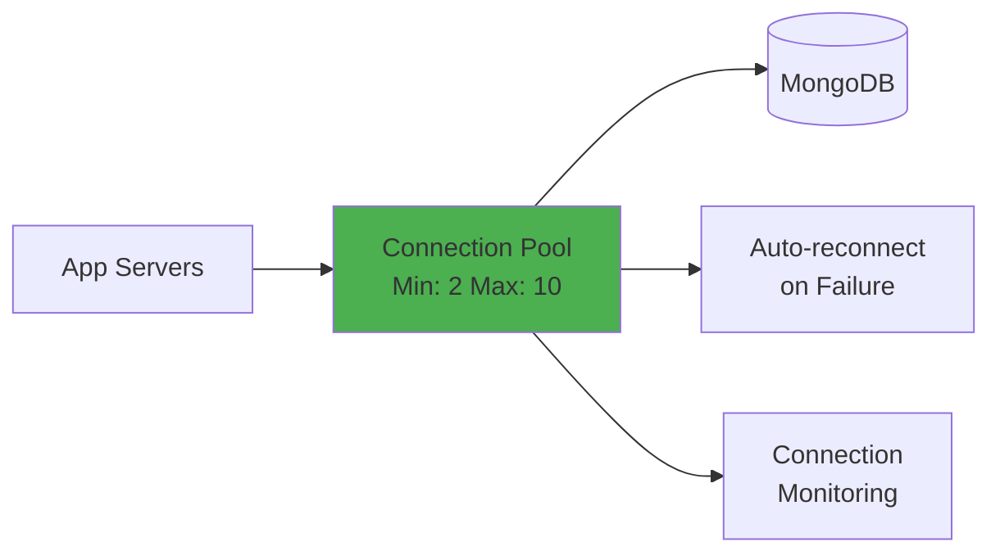
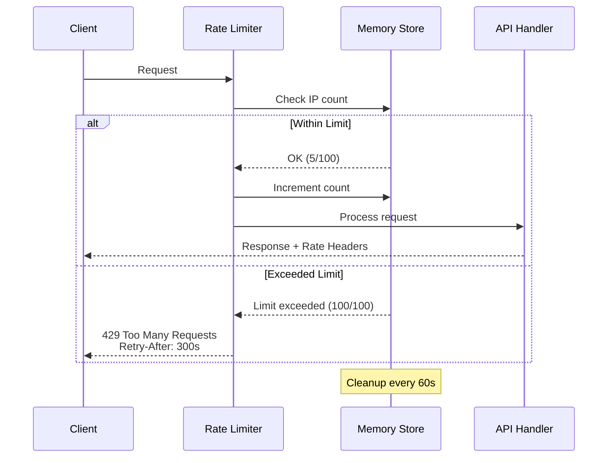

# Ouiimi - Project Context & Architecture

## Table of Contents
- [System Overview](#system-overview)
- [Architecture Diagram](#architecture-diagram)
- [Error Handling Flow](#error-handling-flow)
- [Scalability Features](#scalability-features)
- [Production Readiness](#production-readiness)

---

## System Overview

**Ouiimi** is a service booking platform built with **Next.js 14**, **MongoDB**, and **TypeScript**. It enables businesses to register, list services, manage staff, and handle bookings from customers.

### Technology Stack
- **Frontend**: Next.js 14 (App Router), React 18, TypeScript, TailwindCSS
- **Backend**: Next.js API Routes, MongoDB with Mongoose
- **Authentication**: JWT tokens
- **Email**: Mailjet integration
- **Security**: Rate limiting, CSRF protection, secure headers

---

## Architecture Diagram



## Error Handling Flow

### Production-Grade Error Handling Architecture

```mermaid
flowchart TD
    Start[API Request] --> Auth{Authenticate}
    Auth -->|Invalid| AuthError[AuthenticationError]
    Auth -->|Valid| Validate{Validate Input}
    
    Validate -->|Invalid| ValidationError[ZodError]
    Validate -->|Valid| CheckPerms{Check Permissions}
    
    CheckPerms -->|Denied| PermError[AuthorizationError]
    CheckPerms -->|Allowed| Business{Business Logic}
    
    Business -->|Not Found| NotFoundError[NotFoundError]
    Business -->|Conflict| ConflictError[ConflictError]
    Business -->|DB Error|  DBError[DatabaseError]
    Business -->|Success| SuccessResp[Success Response]
    
    AuthError --> ErrorHandler[Centralized<br/>Error Handler]
    ValidationError --> ErrorHandler
    PermError --> ErrorHandler
    NotFoundError --> ErrorHandler
    ConflictError --> ErrorHandler
    DBError --> ErrorHandler
    
    ErrorHandler --> Logger[Production Logger]
    Logger --> CheckEnv{Production?}
    
    CheckEnv -->|Yes| ProdResp[Generic Error Message<br/>No Sensitive Data]
    CheckEnv -->|No| DevResp[Detailed Error<br/>+ Stack Trace]
    
    ProdResp --> Client[Client Response]
    DevResp --> Client
    
    Logger -.Future.-> Sentry[Sentry/DataDog]
    
    style ErrorHandler fill:#ff9800
    style Logger fill:#2196f3
    style Sentry fill:#f44336
```

### Error Classes Hierarchy

```typescript
ApiError (Base)
├── ValidationError (400)
├── AuthenticationError (401)
├── AuthorizationError (403)
├── NotFoundError (404)
├── ConflictError (409)
├── RateLimitError (429)
├── DatabaseError (500)
└── ExternalServiceError (502)
```

---

## Scalability Features

### 1. Database Connection Pooling



**Configuration:**
```typescript
{
  maxPoolSize: 10,  // Max concurrent connections
  minPoolSize: 2,   // Always maintain 2 connections
  socketTimeoutMS: 45000,
  serverSelectionTimeoutMS: 10000,
  heartbeatFrequencyMS: 10000
}
```

**Benefits:**
- ✅ Handles high concurrent traffic
- ✅ Automatic connection recovery
- ✅ Efficient resource usage
- ✅ Connection health monitoring

### 2. Rate Limiting



**Current Implementation:**
- In-memory store (suitable for single server)
- 100 requests per 15-minute window (configurable)
- IP-based identification
- Automatic cleanup to prevent memory leaks

**Future Enhancement (Distributed Systems):**
```typescript
// Redis-based rate limiting for multi-server setup
import Redis from 'ioredis';
const redis = new Redis(process.env.REDIS_URL);

async function rateLimitWithRedis(ip: string) {
  const key = `rate_limit:${ip}`;
  const current = await redis.incr(key);
  if (current === 1) {
    await redis.expire(key, 900); // 15 minutes
  }
  return current <= 100;
}
```

### 3. Error Response Format

**Production Response (Safe):**
```json
{
  "error": "An unexpected error occurred. Please try again later.",
  "code": "INTERNAL_ERROR",
  "timestamp": "2025-12-04T14:15:42.123Z"
}
```

**Development Response (Detailed):**
```json
{
  "error": "Failed to connect to database",
  "code": "DATABASE_ERROR",
  "timestamp": "2025-12-04T14:15:42.123Z",
  "details": {
    "message": "ECONNREFUSED 127.0.0.1:27017",
    "stack": "Error: ECONNREFUSED..."
  }
}
```

---

## Production Readiness

### ✅ Implemented Best Practices

#### Security
- ✅ JWT authentication
- ✅ Rate limiting (100 req/15min)
- ✅ Security headers (CSP, XSS, Frame Protection)
- ✅ Input validation with Zod
- ✅ Production-safe error messages (no data leakage)

#### Scalability
- ✅ Database connection pooling (10 connections)
- ✅ Automatic reconnection with backoff
- ✅ Memory-efficient rate limiting
- ✅ Connection health monitoring

#### Error Handling
- ✅ Centralized error handler
- ✅ Custom error classes with HTTP codes
- ✅ Production logger with levels
- ✅ Structured logging (JSON format)
- ✅ Environment-aware error responses

#### Code Quality
- ✅ TypeScript for type safety
- ✅ Zod for runtime validation
- ✅ Consistent error responses
- ✅ Separation of concerns

### 🚀 Recommended for Production Scale

#### Monitoring & Logging
```typescript
// Integrate Sentry for error tracking
import * as Sentry from "@sentry/nextjs";

Sentry.init({
  dsn: process.env.SENTRY_DSN,
  environment: process.env.NODE_ENV,
  tracesSampleRate: 1.0,
});
```

#### Distributed Rate Limiting
```bash
# For multi-server deployments
npm install ioredis
```

#### Database
- **MongoDB Atlas** with auto-scaling
- **Read replicas** for read-heavy operations
- **Indexes** on frequently queried fields
- **Regular backups** and monitoring

#### Caching
```typescript
// Redis for session and data caching
import Redis from 'ioredis';

const cache = new Redis(process.env.REDIS_URL);

async function getCachedData(key: string) {
  const cached = await cache.get(key);
  if (cached) return JSON.parse(cached);
  
  const data = await fetchFromDB();
  await cache.set(key, JSON.stringify(data), 'EX', 3600);
  return data;
}
```

#### Load Balancing
```
Client --> Nginx/Cloudflare
    --> Next.js Server 1
    --> Next.js Server 2
    --> Next.js Server 3
        --> MongoDB Atlas
        --> Redis Cluster
```

---

## API Error Codes Reference

| Code | HTTP Status | Description | User Action |
|------|-------------|-------------|-------------|
| `VALIDATION_ERROR` | 400 | Invalid input data | Fix form errors |
| `AUTHENTICATION_ERROR` | 401 | Missing or invalid token | Sign in again |
| `AUTHORIZATION_ERROR` | 403 | Insufficient permissions | Contact support |
| `NOT_FOUND` | 404 | Resource doesn't exist | Check URL/ID |
| `CONFLICT` | 409 | Duplicate resource | Use different values |
| `RATE_LIMIT_EXCEEDED` | 429 | Too many requests | Wait and retry |
| `DATABASE_ERROR` | 500 | Database operation failed | Try again |
| `INTERNAL_ERROR` | 500 | Unexpected server error | Contact support |
| `EXTERNAL_SERVICE_ERROR` | 502 | Third-party service down | Try again later |

---

## File Structure

```
lib/
├── errors/
│   ├── api-error.ts        # Custom error classes
│   └── error-handler.ts    # Centralized error handler
├── logger/
│   └── index.ts            # Production logger
├── security/
│   └── rate-limit.ts       # Rate limiting middleware
└── db.ts                   # Database connection with pooling

hooks/
└── use-error-handler.tsx   # Frontend error handling hook

app/api/
└── services/route.ts       # Example: Uses error infrastructure
```

---

## Deployment Checklist

### Environment Variables
```bash
# Required
MONGODB_URI=mongodb+srv://...
JWT_SECRET=your-secret-key
NEXT_PUBLIC_API_URL=https://api.yourdomain.com

# Optional (with defaults)
RATE_LIMIT_WINDOW_MS=900000
RATE_LIMIT_MAX_REQUESTS=100

# Production (recommended)
SENTRY_DSN=https://...@sentry.io/...
REDIS_URL=redis://...
```

### Pre-deployment
- [ ] Set `NODE_ENV=production`
- [ ] Configure MongoDB Atlas with proper indexes
- [ ] Set up Sentry or error tracking service
- [ ] Configure CDN (Cloudflare/Vercel)
- [ ] Set up monitoring (uptime checks)
- [ ] Configure backups
- [ ] Run security audit: `npm audit`
- [ ] Test rate limiting under load
- [ ] Verify all API endpoints return proper error codes

---

## Performance Under Load

### Expected Capacity

| Metric | Value | Notes |
|--------|-------|-------|
| Concurrent Connections | 10 | MongoDB pool size |
| Requests per Server | 100/15min per IP | Rate limit |
| Response Time | <200ms | P95 with DB pooling |
| Memory Usage | ~512MB | Per Node.js instance |

### Scaling Strategy

1. **Vertical Scaling**: Increase server resources
2. **Horizontal Scaling**: Add more Next.js instances behind load balancer
3. **Database Scaling**: MongoDB Atlas auto-scaling + read replicas
4. **Caching**: Add Redis for frequently accessed data
5. **CDN**: Static assets via Cloudflare/Vercel Edge

---

**Last Updated**: December 2025  
**Version**: 1.0.0
